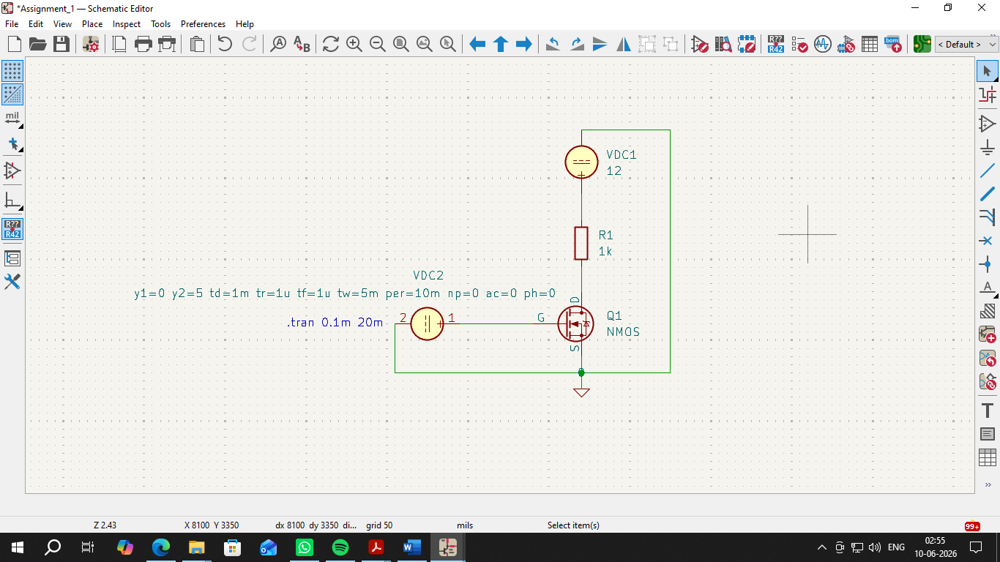
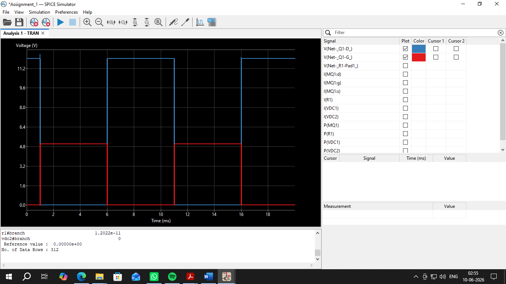

<div align="center">

# MOSFET as a Switch: KiCad SPICE Simulation

### Demonstrating N-Channel MOSFET switching behavior through KiCad transient SPICE analysis

[](https://github.com/satvikpandurangi/MOSFET-As-Switch-Kicad-Simulation)
[](https://www.kicad.org/)
[](https://ngspice.sourceforge.io/)

</div>

---

## 📖 Overview

This repository contains a fully functional KiCad schematic and SPICE simulation demonstrating how an N-Channel Enhancement MOSFET operates as an electronic switch. Using KiCad's integrated `ngspice` engine, the project models a transistor controlling a resistive load and verifies its switching behavior through transient analysis — bypassing the need for physical hardware prototyping.

## 🎯 Objectives

- Design and construct an N-Channel Enhancement MOSFET switching circuit in KiCad
- Simulate the circuit's transient response to a digital control signal
- Verify the MOSFET's operation across its cut-off and saturation regions

## ✨ Features

- Complete, ready-to-open KiCad schematic of a MOSFET switching circuit
- Transient SPICE simulation (`.tran 0.1m 20m`) over a 20 ms window
- Clear demonstration of the inverse relationship between gate input and drain output
- Tabulated logic states correlating gate voltage to MOSFET conduction

## ⚙️ Circuit Overview

A 12 V DC source powers a 1 kΩ load resistor connected to the MOSFET's Drain. The Source terminal is tied to Ground, while a Pulse Voltage Source drives the Gate with a 0–5 V square wave (10 ms period):

- **Cut-off (Switch OFF):** V_GS < V_th → channel open → no current flows, Drain sits at 12 V
- **Saturation (Switch ON):** V_GS > V_th → channel conducts → current flows to ground, Drain drops to ~0 V

## 🧩 Components Used

| Type | Component | Value / Rating |
|------|-----------|-----------------|
| Active | N-Channel Enhancement MOSFET (VDMOS) | — |
| Passive | Resistor (Load) | 1 kΩ |
| Source | DC Voltage Source (Main Power) | 12 V |
| Source | Pulse Voltage Source (Gate Control) | 0–5 V, 10 ms period |
| Misc | Ground terminals | — |

## 🛠️ Software & Simulation

Built and simulated entirely in **KiCad EDA**, using its two core subsystems:

- **Schematic Editor** — for laying out the MOSFET, resistor, and voltage sources, and routing the circuit nets
- **Integrated SPICE Simulator (ngspice)** — translates the schematic into a netlist and runs the configured Transient Analysis to plot the Gate and Drain voltage waveforms

**Requirements:** KiCad (v6.0+ recommended) with the integrated `ngspice` simulator (included by default).

## 📂 Repository Structure

```
.
├── MOSFET_As_Switch.kicad_pro   # Main KiCad project file
├── MOSFET_As_Switch.kicad_sch   # Schematic and SPICE directives
├── MOSFET_As_Switch.kicad_pcb   # PCB layout file
├── MOSFET_Schematic.png         # Circuit schematic
├── MOSFET_Output.png            # Simulation waveform output
└── README.md
```

## 🚀 How to Open & Run

1. Clone the repository:
   ```bash
   git clone https://github.com/satvikpandurangi/MOSFET-As-Switch-Kicad-Simulation.git
   ```
2. Open `MOSFET_As_Switch.kicad_pro` in the KiCad Project Manager.
3. Open the Schematic Editor to view the circuit layout.
4. Go to **Inspect > Simulator** and click **Run/Stop Simulation**.
5. Probe the Gate (input) and Drain (output) nets to view the switching waveforms.

## 📊 Simulation Results

| Gate Voltage (V_GS) | Input Logic | MOSFET State | Drain Voltage (V_Drain) | Load Status |
|----------------------|-------------|----------------|---------------------------|------------------------|
| 0.0 V | LOW (0) | OFF (Cut-off) | ~12.0 V | Unpowered (no current) |
| 5.0 V | HIGH (1) | ON (Conducting) | ~0.0 V | Powered (current flowing) |

The transient simulation confirmed the MOSFET acts as a reliable voltage-controlled switch: a HIGH gate signal pulls the Drain to near 0 V, while a LOW gate signal leaves the Drain at the full 12 V supply.

## 📸 Screenshots





